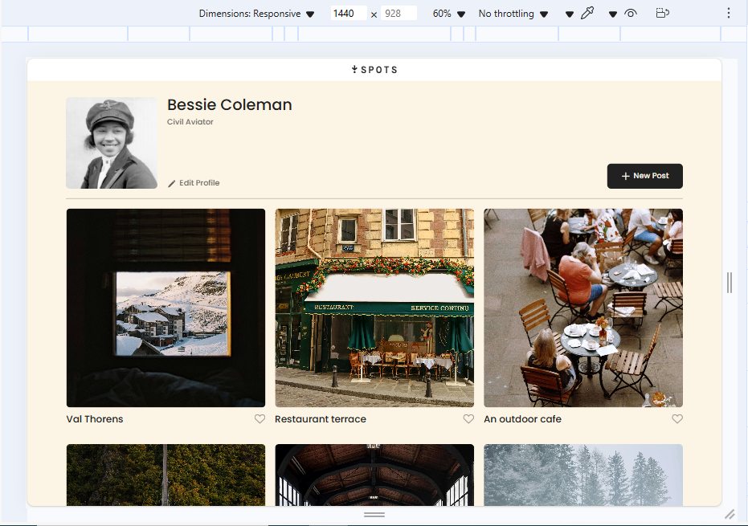
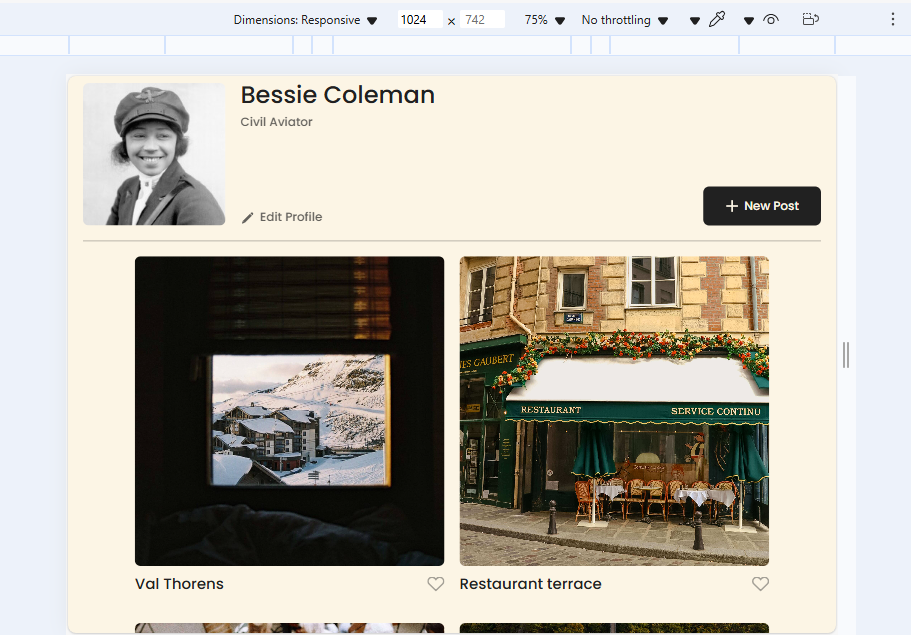
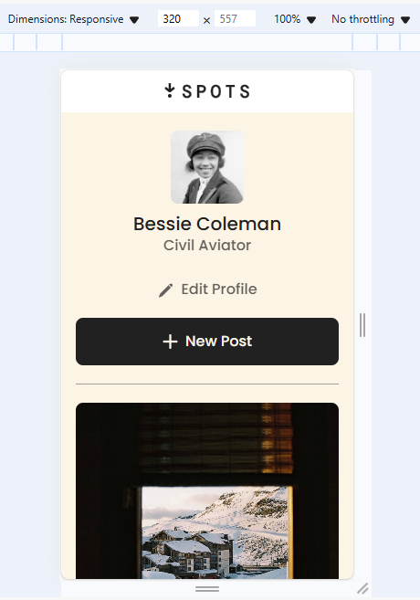

# Project 3: Spots

## Description

"Spots" is a dynamic web application and photo-sharing platform designed for social media users such as travelers and photography enthusiasts to share their travel history, experiences, and interests through a curated collection of photographs. This responsive platform allows users to share, explore, discover, and interact with beautiful various locations shared by the community. The project features a responsive design that works seamlessly across different device sizes, from desktop to mobile. Users can view photo cards, like their favorite spots, and manage their profile information.

The application features an elegant, user-friendly interface where visitors can:

- Browse through a collection of location-based photographs
- Interact with content through an intuitive 'like' system
- View and customize their profile information
- Experience seamless viewing across all devices (desktop, tablet, and mobile)

Built with modern web technologies and following BEM methodology, Spots demonstrates responsive design principles and efficient CSS architecture. The interface smoothly adapts from mobile devices (320px) to large desktop screens, ensuring an optimal viewing experience across all platforms.

## Features

- Responsive design layout that adapts to different screen sizes
- Customizable photo gallery
- Profile section with editable user information
- Like System with interactive heart-shaped icon button for liking photos
- Photo grid where users can add photos
- Text overflow handling with ellipsis
- Hover effects on interactive elements
- Mobile-first approach to media queries

## Technologies and Techniques Used

- **HTML5**
- **CSS3** with Flexbox and Grid layouts
- **BEM Methodology** for class naming and file structure
- **Responsive Design** with media queries, flexbox, and grid layout
- **CSS properties** for image handling and text overflow
- **Flat BEM file structure**

## Project Structure

The project follows BEM methodology with the following structure:

- `blocks/` - Contains BEM blocks
- `images/` - Image assets
- `pages/` - CSS files for pages
- `vendor/` - Third-party files (normalize.css, fonts)

## Future Improvements

- Add JavaScript functionality for the like button
- Implement profile editing feature
- Add photo upload capability
- Create user authentication

Recent Updates (Date: [05/03/2025])

#### Form Validation Implementation

- Core Functionality
  - Added comprehensive form validation system (validation.js)
  - Implemented real-time input validation with visual feedback
  - Created dynamic error message display
  - Added submit button state management based on form validity

#### Modal System Enhancements

- Interaction Improvements
  - Added ESC key support for closing modals
  - Implemented overlay click detection
  - Enhanced event listener cleanup
  - Added form reset functionality on modal close

#### Code Quality Updates

- Structure and Organization
  - Created centralized settings object for validation configuration
  - Implemented modular validation functions
  - Added utility functions for error handling
  - Enhanced code maintainability

## Running the Project

The project can be run locally by cloning the repository and opening index.html in a web browser.

## Demo

https://ruthlessrebekah.github.io/se_project_spots

## Screenshots

## Video

https://drive.google.com/file/d/11DFBf0nYyvh6G34_nhYO3PILlLnRPjNm/view?usp=sharing
