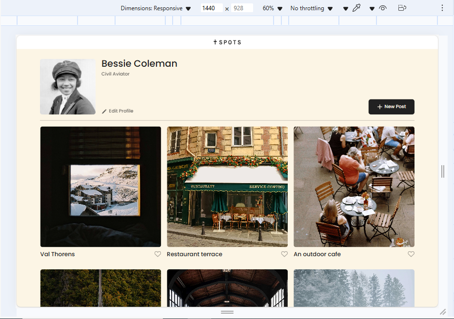
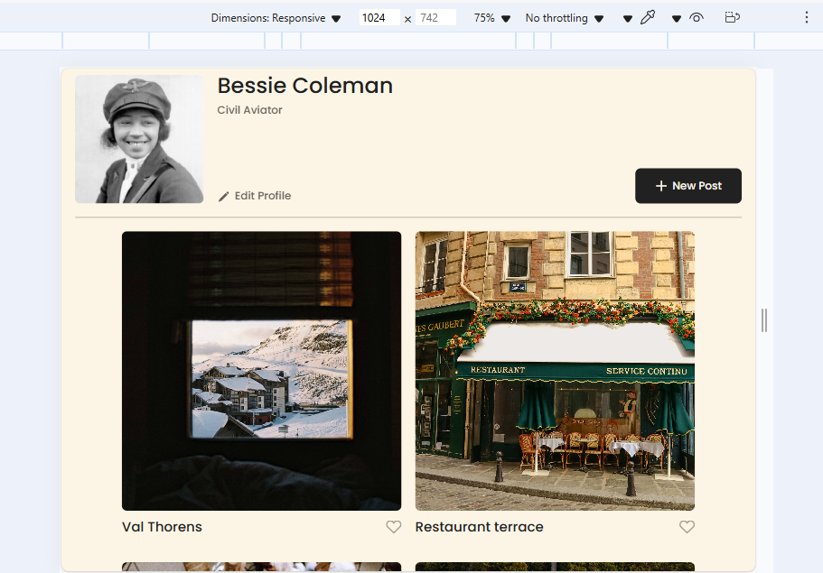
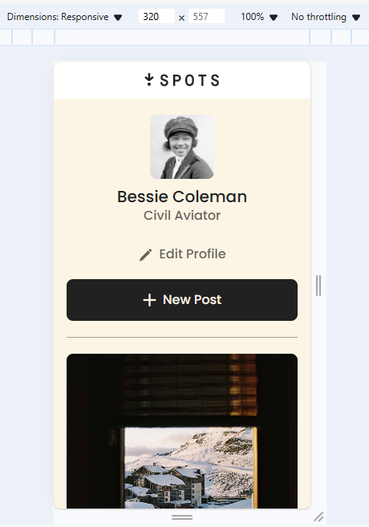

# Project 3: Spots

## Description

"Spots" is a dynamic web application and photo-sharing platform designed for social media users such as travelers and photography enthusiasts to share their travel history, experiences, and interests through a curated collection of photographs. This responsive platform allows users to share, explore, discover, and interact with beautiful various locations shared by the community. The project features a responsive design that works seamlessly across different device sizes, from desktop to mobile. Users can view photo cards, like their favorite spots, and manage their profile information.

The application features an elegant, user-friendly interface where visitors can:

- Browse through a collection of location-based photographs
- Interact with content through an intuitive 'like' system
- View and customize their profile information
- Experience seamless viewing across all devices (desktop, tablet, and mobile)

Built with modern web technologies and following BEM methodology, Spots demonstrates responsive design principles and efficient CSS architecture. The interface smoothly adapts from mobile devices (320px) to large desktop screens, ensuring an optimal viewing experience across all platforms.

## Features

- Responsive design layout that adapts to different screen sizes
- Customizable photo gallery
- Profile section with editable user information
- Like System with interactive heart-shaped icon button for liking photos
- Photo grid where users can add photos
- Text overflow handling with ellipsis
- Hover effects on interactive elements
- Mobile-first approach to media queries

## Technologies and Techniques Used

- **HTML5**
- **CSS3** with Flexbox and Grid layouts
- **BEM Methodology** for class naming and file structure
- **Responsive Design** with media queries, flexbox, and grid layout
- **CSS properties** for image handling and text overflow
- **Flat BEM file structure**

## Project Structure

The project follows BEM methodology with the following structure:

- `blocks/` - Contains BEM blocks
- `images/` - Image assets
- `pages/` - CSS files for pages
- `vendor/` - Third-party files (normalize.css, fonts)

## Future Improvements

- Add JavaScript functionality for the like button
- Implement profile editing feature
- Add photo upload capability
- Create user authentication

## Recent Updates

## Recent Changes and UI Improvements (June 2025)

### Modal Delete Dialog (Confirmation)

- The delete modal is now fully responsive, with a minimum width of 288px and minimum height of 172px enforced on all screens.
- On mobile (≤600px):
  - The close (x) button floats above the modal, positioned 40px (button height) + 8px (modal padding) above the top right, and 8px from the right edge.
  - The modal title (h2) is padded 12px from the top and sides, and the button row is spaced 20px below the title.
  - Delete and cancel buttons are stacked vertically, centered, and retain their desktop width.
- On desktop/laptop, the close button and modal layout revert to their original positions and styles.

### Like Button Logic

- Like button state is now robust and always reflects the correct state on page load and after user interaction.
- The user's like state persists visually and functionally, using the latest API data.
- Like button event listeners and state updates are grouped and clearly commented in the main JS file.

### General CSS and Responsiveness

- All mobile-specific modal changes are contained within media queries, ensuring desktop and mobile styles do not conflict.
- Modal, card, and button styles use `clamp()`, min/max sizes, and transitions for smooth, fluid resizing.
- No mobile overrides are present outside of media queries, keeping the codebase clean and maintainable.

### Accessibility and Usability

- Modal close buttons are always accessible and visually clear on all screen sizes.
- Form fields and buttons have improved spacing and minimum sizes for touch usability.

### How to Test

- Resize your browser or use device emulation to verify modal and card appearance and behavior on both mobile and desktop.
- Confirm the close (x) button floats above the modal only on mobile, and returns to its original position on larger screens.
- Ensure the modal never shrinks below its minimum size and that all content remains readable and accessible.
- Test like button state persistence and visual feedback.

---

### 2025-05-03

#### Form Validation Implementation

- Core Functionality
  - Added comprehensive form validation system (validation.js)
  - Implemented real-time input validation with visual feedback
  - Created dynamic error message display
  - Added submit button state management based on form validity

#### Modal System Enhancements

- Interaction Improvements
  - Added ESC key support for closing modals
  - Implemented overlay click detection
  - Enhanced event listener cleanup
  - Added form reset functionality on modal close

#### Code Quality Updates

- Structure and Organization
  - Created centralized settings object for validation configuration
  - Implemented modular validation functions
  - Added utility functions for error handling
  - Enhanced code maintainability

### 2025-06-15

- Integrated webpack for asset bundling (images, fonts, CSS, JS)
- Updated webpack config to support asset/resource for images and fonts
- Refactored image/font imports in JS and CSS for compatibility with webpack
- Fixed 404 errors for static assets in dev server
- Improved project structure for build output

### 2025-06-16

- Debugged and resolved issues with image/font loading in webpack build
- Updated documentation for asset management
- Added update notes to README
- General code cleanup and minor bug fixes

## Implementation Highlights & Project Fulfillment (June 2025)

### API Integration & Modularization

- All server communication is handled through a dedicated `Api` class, with each endpoint implemented as a method.
- The class is instantiated in the main JS file, and all requests include the required authorization token.
- Error handling is robust, with clear logging and user feedback.

### Card & Like System

- Cards are rendered dynamically from server data, and all card actions (like, delete) use the card's unique ID.
- The like button state is always in sync with the server, both on initial load and after user interaction, ensuring accurate and persistent feedback.

### Profile & Avatar Management

- User profile and avatar updates are performed via PATCH requests, with real-time UI updates and loading states ("Saving...") for improved user experience.
- The avatar input uses proper validation, and the edit button adapts responsively for mobile and desktop.

### Responsive, Accessible UI

- All modals, cards, and buttons are fully responsive, using `clamp()`, min/max sizes, and smooth transitions.
- The delete confirmation modal and close button are styled per Figma specs for both mobile and desktop.
- Accessibility and usability are prioritized, with clear focus states and minimum touch sizes.

### Form UX & Feedback

- All forms display loading states during server requests, and error handling is consistent across the app.
- Form validation is modular and provides immediate feedback.

### Webpack & Asset Management

- Webpack is used for bundling JS, CSS, images, and fonts.
- All assets are imported for compatibility, and the project structure is optimized for build output and deployment.

### Code Quality

- The codebase is organized into ES6 modules, with clear comments and logical grouping for maintainability.
- All event listeners are defined before use, and callback functions are modularized.

## Running the Project

The project can be run locally by cloning the repository and opening index.html in a web browser.

## Demo

https://ruthlessrebekah.github.io/se_project_spots

## Screenshots

## Video

https://drive.google.com/file/d/11DFBf0nYyvh6G34_nhYO3PILlLnRPjNm/view?usp=sharing
